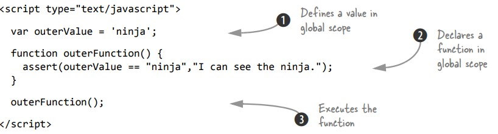

# Chương 5: Từng bước tiếp cận closure
**Những vấn đề được đề cập trong chưa này**
- *Closure* là gì và nó hoạt động như thế nào
- Sử dụng *closure* để đơn giản hóa mã được phát triển
- Cải thiện hiệu năng bằng *closure*
- Giải quyết các vấn đề thường gặp về *scope* với *closure*.
## 5.1. Closure hoạt động như thế nào
This concept is probably best explained through code, so let’s start small with the
following listing
Nói một cách ngắn gọn, *closure* là *scope* được tạo ra khi một hàm được khai báo cho phép hàm có thể truy cập và thao tác các biến bên ngoài để chức năng đó. Nói cách khác, *closure* cho phép một hàm truy cập tất cả các biến, cũng như các hàm khác, nằm trong *scope* khi chính hàm đó được khai báo. Điều đó có vẻ khá trực quan cho đến khi bạn nhớ rằng một hàm được khai báo có thể được gọi bất cứ lúc nào sau đó, ngay cả sau khi *scope* trong đó nó đã biến mất. Khái niệm này có lẽ được giải thích tốt nhất thông qua *code*, vì vậy chúng ta hãy bắt đầu một bước nhỏ với đoạn mã sau:  
Code 5.1: closure đơn giản:  
